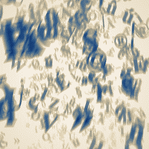
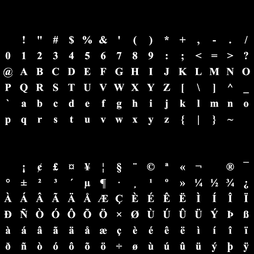

# Everyday One Motion - 20160421 "Rain of Chars"  

  

JavaScript, WebGL, GPGPU Particle  

[Everyday One Motion](http://motions.work/motion/198)  
[Demo Page](http://fms-cat.github.io/eom_20160421)  

## はじめに

Q: 手を抜きましたか？  
A: はい。

## Sprite

16x16のグリッド上にに文字を敷き詰めてSprite Tableを作成しています。  
パーティクルをRenderする際にテクスチャ位置をいい感じに調整して文字を表示しています。  

